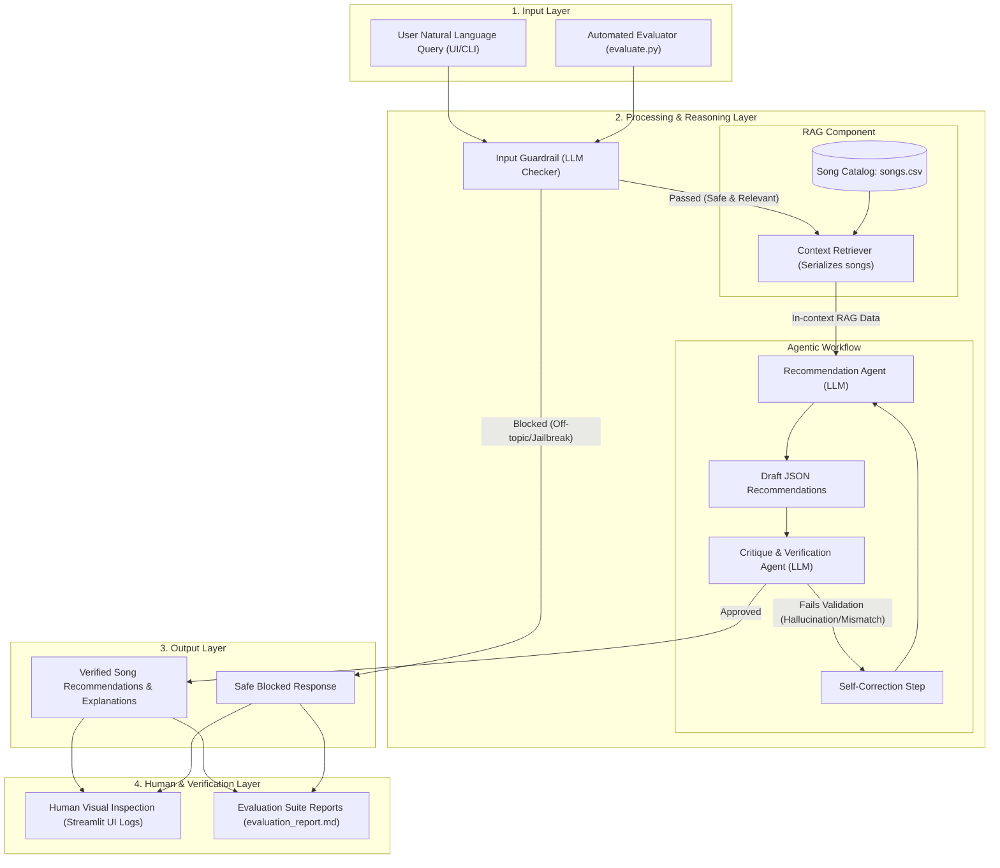

# EchoMatch 2.0 System Architecture & Data Flow

This document details the components, data flow, and evaluation touchpoints of EchoMatch 2.0.

## Component Definitions

1. **Input Guardrail**: Blocks jailbreaks, prompt injections, and off-topic prompts.
2. **Context Retriever (RAG)**: Serializes the 20-song catalog from `data/songs.csv` and injects it as context into the prompt, ensuring the AI only recommends existing songs.
3. **Recommendation Agent**: Reasons over the user's mood, genre, and acoustic requests to select the best songs from the catalog context.
4. **Critique Agent**: Detects hallucinations (checks returned IDs against the database) and flags severe matches mismatches.
5. **Automated Evaluator**: The CLI test runner that programmatically inspects outcomes to log passing rates.
6. **Human Interaction (Streamlit UI)**: Exposes the step-by-step agent logs so users can inspect *why* a song was recommended and review the system's decisions.
